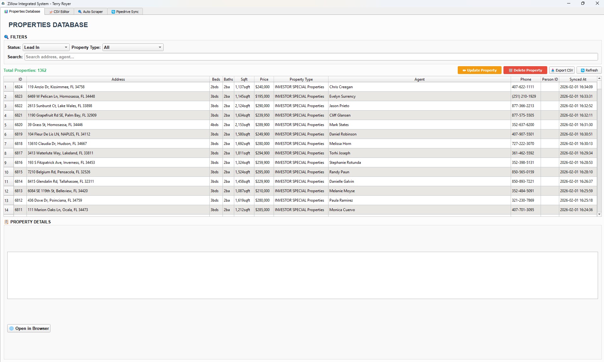
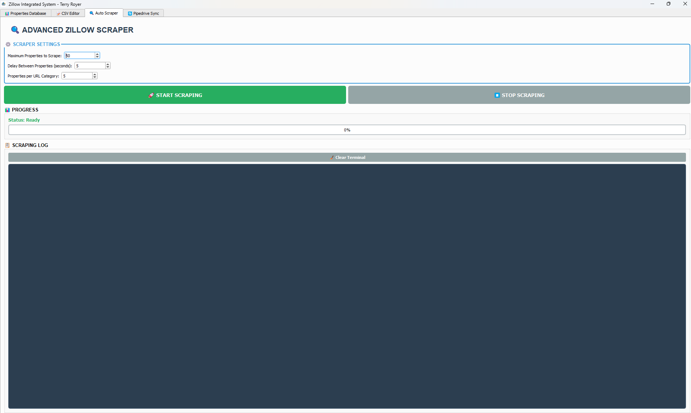
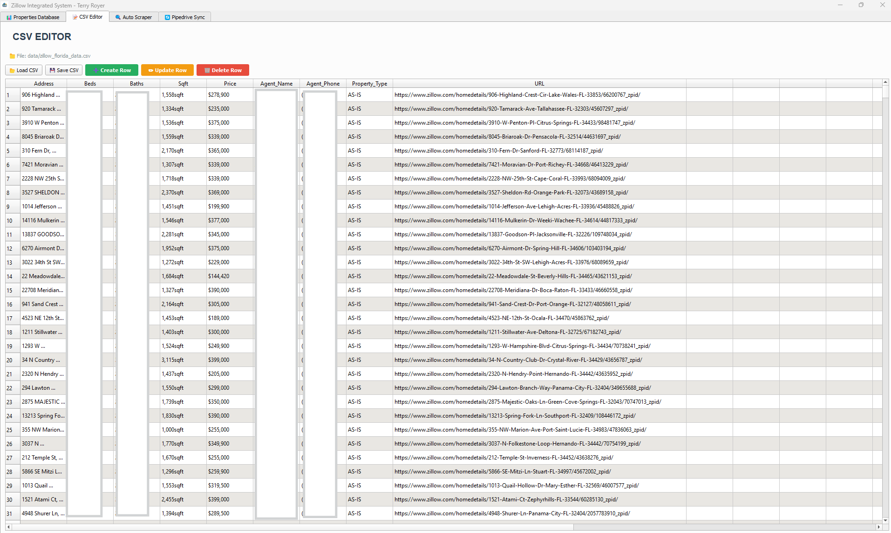
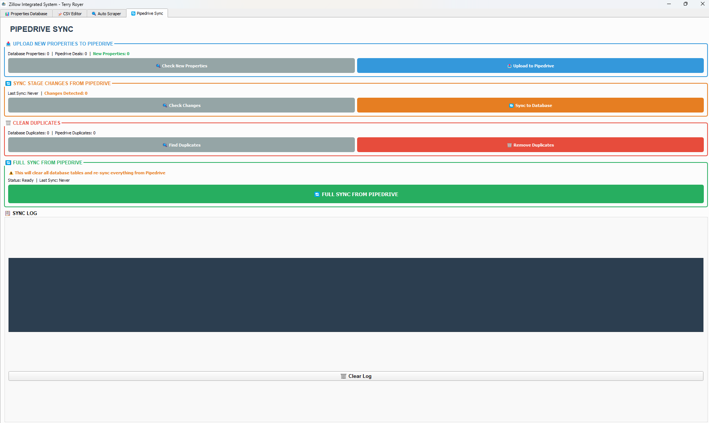

# 🏠 Zillow – Pipedrive Integrated Desktop System

> **Private, production-ready desktop automation system** built for real estate investors and acquisition teams.  
> This system automates Zillow property scraping, agent data extraction, and seamless synchronization with Pipedrive CRM through a powerful desktop application.

---

## 📌 Introduction

Real estate investors often rely on multiple disconnected tools to source properties, extract agent information, and manage leads inside a CRM. This manual workflow is time-consuming, error-prone, and difficult to scale.

The **Zillow – Pipedrive Integrated Desktop System** solves this problem by providing a **single, unified desktop solution** that automates the complete pipeline — from property discovery on Zillow to structured deal creation inside Pipedrive.

The system is designed as a **real-world, client-deployable application**, not a demo or proof-of-concept script. It includes a graphical desktop interface, persistent database storage, duplicate protection, and CRM stage synchronization to support daily operational use.


---

## 🚀 System Overview & Workflow

The Zillow – Pipedrive Integrated Desktop System is designed around a **clear, linear, and fully automated workflow** that mirrors how real estate investors actually operate in production environments.

Instead of relying on scattered scripts or browser extensions, the system centralizes all operations into a **single desktop application** with persistent storage, visual feedback, and controlled execution.

### 🔁 End-to-End Workflow

The system follows the workflow below:

**Zillow Search URLs → Property Scraping → Agent Extraction → Local Database → CSV Management → Pipedrive CRM**

Each stage is intentionally separated yet tightly integrated, allowing both **automation and manual oversight** where required.

### 🔍 Zillow Property Discovery

The system begins by consuming predefined Zillow search URLs focused on **investor-oriented listings** such as:
- AS-IS properties  
- Fixer uppers  
- Investor special listings  
- TLC and value-add opportunities  

These URLs are configurable and can be updated without modifying application code.

### 🧠 Data Extraction & Processing

For each property:
- Listing metadata is captured (address, price, beds, baths, square footage)
- Agent name and phone number are extracted using multiple intelligent detection strategies
- Pagination is handled automatically to ensure **all listings** are processed, not just the first page

### 🗃️ Local Data Layer

All extracted data is stored locally using:
- **SQLite database** for long-term tracking and state management
- **CSV files** for portability, auditing, and external review

Duplicate listings are automatically detected and filtered to prevent redundant processing.

### 🔄 CRM Synchronization

Once validated, properties are synchronized with **Pipedrive CRM** as structured deals.  
The system supports:
- Automatic deal creation
- Stage-based workflow mapping
- Two-way synchronization between CRM and local database

This ensures the CRM always reflects the **true operational state** of each property.

### 🖥️ Desktop-Controlled Execution

All workflow stages are executed through a **PyQt5-based desktop interface**, providing:
- Manual start/stop control
- Visual progress indicators
- Live execution logs
- Safe interruption handling

This design ensures reliability, transparency, and usability for daily business operations.


----

## 🖥️ Desktop Application UI

The system is delivered as a **fully interactive desktop application** built using **PyQt5**, allowing users to control every stage of the automation pipeline from a single interface.

The UI is intentionally structured around **real operational tasks**, ensuring clarity, speed, and minimal learning curve for daily use.

---

### 🧭 Main Dashboard

The main dashboard provides a centralized view of the system, allowing users to:
- Navigate between functional modules
- Monitor system status
- Access logs and execution feedback




---


## ✨ Core Features (Detailed)

This system is built as a **complete production automation platform**, covering scraping, data processing, storage, and CRM synchronization in one controlled desktop environment.

---

### 🔍 Advanced Zillow Scraping Engine

- Supports investor-focused Zillow listings (AS-IS, TLC, Fixer Upper, Investor Special)
- Handles full pagination to ensure all available listings are scraped
- Uses JavaScript-rendered scraping for accuracy
- Includes retry logic, timeout handling, and stealth proxy support
- URL-driven scraping allows easy updates without changing source code


---

### 🧠 Intelligent Agent Data Extraction

- Extracts agent names and phone numbers using multiple strategies
- Combines DOM-based parsing with embedded JSON pattern matching
- Automatically falls back to alternative extraction methods if layouts change
- Designed to remain resilient against Zillow UI updates

---

### 🗃️ Local Database & CSV Management

- Uses SQLite as a persistent local database
- Stores complete property and agent metadata
- Integrated CSV editor allows viewing and modifying data directly from the UI
- Prevents duplicate properties using database and CSV checks
- Enables long-term tracking of processed listings

---


### 🔄 Pipedrive CRM Integration

- Automatically creates deals in Pipedrive from scraped properties
- Maps CRM stages to local database tables
- Supports two-way synchronization:
  - Local → Pipedrive (new deals)
  - Pipedrive → Local database (stage updates)
- Includes full pipeline synchronization option
- Protects against duplicate deal creation

---


### 🖥️ Desktop Application Controls

- Built using PyQt5 for reliability and performance
- Tab-based layout for logical workflow separation
- Live logs and progress indicators during execution
- Safe start/stop controls to prevent partial or corrupted runs
- Designed for non-technical daily users

---

## ⚙️ Configuration & Setup

The system follows **secure configuration practices**.

### 🔐 Configuration File Setup
Create a local configuration file by copying:
config.example.ini → config.ini


[SCRAPINGBEE]
api_key = YOUR_SCRAPINGBEE_API_KEY

[PIPEDRIVE]
api_token = YOUR_PIPEDRIVE_API_TOKEN
api_url = https://api.pipedrive.com/v1

[DATABASE]
db_path = data/zillow.db

[CSV]
csv_path = data/zillow_florida_data.csv

[URLS]
urls_file = scraping_urls.txt
```md
### Development Mode
pip install -r requirements.txt
python zillow_pipedrive_ui.py

```md


